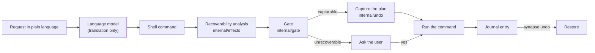

# Recoverability Analysis — Reference

## Overview

This is the single reference for SynapseOS's algorithmic contribution: a static analysis that reads a shell command before it runs, works out which files it will remove, overwrite, or re-permission (including targets hidden behind `find`, `xargs`, loops, `sudo`, and `sh -c`), and either backs exactly those files up so the command can be undone, or asks first when it cannot. It covers the problem, the formal model, every step of the algorithm, a complete map of its rules (generated from the code, so it cannot drift), the guarantees it makes and the test behind each, its cost, its evaluation, and its known limits. In short: on 777 held-out commands, no destructive command ran unprotected; 89.5% of file-destroying commands were backed up and verified restorable, against 35.4% with the same rule table and the composition switched off; and the core guarantee, that the analysis only ever executes read-only commands, held across 336,639 fuzzed command lines. `algorithms.md` keeps the design history; this file is what the algorithm is now.

## Table of Contents

- [Overview](#overview)
- [How to use this document](#how-to-use-this-document)
- [1. The problem](#1-the-problem)
- [2. Where it sits in SynapseOS](#2-where-it-sits-in-synapseos)
- [3. The model](#3-the-model)
  - [Effects](#effects)
  - [Issues](#issues)
  - [Verdict](#verdict)
  - [Plan](#plan)
- [4. The algorithm, step by step](#4-the-algorithm-step-by-step)
  - [Step 1: parse and expand](#step-1-parse-and-expand)
  - [Step 2: walk the structure](#step-2-walk-the-structure)
  - [Step 3: dispatch each command](#step-3-dispatch-each-command)
  - [Step 4: resolve run-time targets](#step-4-resolve-run-time-targets)
  - [Step 5: decide](#step-5-decide)
  - [Step 6: plan the capture](#step-6-plan-the-capture)
  - [Step 7: gate, capture, run, undo](#step-7-gate-capture-run-undo)
- [5. A worked example](#5-a-worked-example)
- [6. Guarantees, and the test behind each](#6-guarantees-and-the-test-behind-each)
- [7. Cost](#7-cost)
- [8. The rule map](#8-the-rule-map)
    - [Composition: what the analysis resolves through](#composition-what-the-analysis-resolves-through)
    - [Mutating rules](#mutating-rules)
    - [Resolvers: the only commands the analysis runs](#resolvers-the-only-commands-the-analysis-runs)
    - [Package, service, and system state](#package-service-and-system-state)
    - [Always unrecoverable](#always-unrecoverable)
    - [Read-only](#read-only)
- [9. Tests](#9-tests)
  - [Automated](#automated)
  - [Coverage, per part of the algorithm](#coverage-per-part-of-the-algorithm)
  - [Mutation testing](#mutation-testing)
  - [Manual](#manual)
- [10. Evaluation results](#10-evaluation-results)
- [11. Limits and known failure cases](#11-limits-and-known-failure-cases)
- [12. Where the work goes next](#12-where-the-work-goes-next)
- [13. Reproducing everything](#13-reproducing-everything)
- [14. Source map](#14-source-map)

## How to use this document

Read section 1 and the worked example (section 5) for the idea. Sections 3 and 4 are the specification. Section 6 is what a reviewer asking "how do you know it is safe" needs. Section 8 is the lookup table for "what does it do with command X". Sections 9 and 10 are the evidence, and 11 is what it does not do.

What this document does not own: the reasoning behind design choices and the rejected alternatives (`algorithms.md`, `decisions.md` D29, D34, D35), the survey of what exists (`prior-art.md`), the comparison with open-source safety lists in full (`external-baselines.md`), and the open bugs (`open-problems.md`). It links to them rather than repeating them.

In the thesis, the algorithm is described in Chapter 3, Section 2.1(c), validated end to end in Section 2.3, and evaluated in Section 3.1 (Tables 3.4 and 3.5).

## 1. The problem

A language model turns a request ("delete my old screenshots") into a shell command. Before that command runs, the system has to decide whether it can lose data and, if so, protect the data or ask. Every shipped tool surveyed (`prior-art.md`, `external-baselines.md`) decides by matching the command's name against a list of dangerous patterns. A list fails in four ways:

| Failure | Example | What happens |
|---|---|---|
| It cannot see inside wrappers | `find . -name '*.png' -exec rm {} +` | The list sees `find`, a search tool, and lets it run |
| It cannot know targets computed while the command runs | `ls *.log \| xargs rm` | Even when it asks, it cannot back anything up, because it does not know which files will go |
| It reasons about names, not effects | `cp a.txt b.txt` | Harmless if `b.txt` is new, destructive if it exists |
| It fails open | `shred`, or any tool nobody listed | An unlisted command runs unchecked |

**The problem, stated precisely.** Given a shell command line and the directory it will run in, compute (1) the set of filesystem effects it will have, seeing through the constructs that hide them and resolving targets that are only known at run time; (2) a verdict: *recoverable*, *recoverable with capture*, or *unrecoverable*; and (3) for the middle case, the minimum set of pre-images (backups) that restores the prior state. Anything that cannot be determined must be treated as unrecoverable, so that it asks.

The contribution is (1)'s composition and resolution, feeding (3). The verdict alone is not the contribution: a list that fails closed matches it on silent loss, but it asks about everything and protects nothing (section 10).

## 2. Where it sits in SynapseOS



**The analysis does not use the language model.** The model only translates the request into a command. The analysis is deterministic program analysis over that command: the same command in the same directory always gets the same answer, and a wrong translation is analysed exactly as faithfully as a right one. This is why the 3B model's translation errors (Chapter 3, Section 2.3) do not affect the algorithm's results.

It is on by default (`SYNAPSE_ANALYSIS` unset means `strict`; `capture` asks less; `off` reverts to the pattern list, for comparison only), per `decisions.md` D35. Two runtime rules sit around it (`prototype/cmd/synapse/analysis.go`). The pattern list is still consulted, and a command it calls irreversible still asks, so **the analysis can add a confirmation but never remove one**. And resolvers (step 4) run only where the bubblewrap sandbox is available (`SYNAPSE_RESOLVE=auto`); without it, anything that needs resolving is unresolved and asks.

## 3. The model

The types are in `prototype/internal/effects/types.go` and `verdict.go`.

### Effects

An **effect** is one thing a command does to one path: a kind, an absolute path, and two refinements.

| Kind | Meaning | Loses data? |
|---|---|---|
| `read` | Part of the model, never emitted | No |
| `create` | A path that did not exist will | No: undo removes it |
| `write` | An existing file's bytes change | Yes, unless captured |
| `remove` | An existing path goes away | Yes, unless captured or moved |
| `metadata` | Mode or ownership changes | Yes, unless recorded |

- **`MovedTo`** marks a removal whose very same bytes survive at another path (a rename or move). It needs no capture: undo moves it back. It is never used for compression or `tar --remove-files`, whose output is different bytes.
- **`Hint: git-head`** marks the one effect that is not a path: the repository's current commit under `git reset --hard`, whose pre-image is a single commit id.

Package and service changes are not paths, so they are a separate kind of result, a **state change**, recorded with the **inverse** commands that put the state back (for example, installing a package records `apt-get purge` of it; stopping a service that was running records starting it).

### Issues

Anything the analysis cannot determine becomes an **issue**, of one of three kinds:

| Kind | Meaning | Examples |
|---|---|---|
| unresolved | The command is modelled, but a target could not be determined | an unbound variable, an unknown working directory, a resolver that is disabled, timed out, or hit a bound |
| opaque | The command is not modelled | an unknown program, `python -c`, a script file, a computed command name, a function defined on the line, a line that does not parse |
| unrecoverable | Modelled, and known not to be restorable from files | `shred`, ending processes, writing a raw device, history-rewriting git, accounts, mounts, firewall |

### Verdict

```
verdict(A) =
  unrecoverable             if A has any issue
                            or some write/remove/metadata target is a device, socket, or pipe
  recoverable-with-capture  else if A has a write, a remove without MovedTo, a metadata change,
                            or a state change with an inverse
  recoverable               otherwise (only creates and moves)
```

Over-approximating costs a confirmation; under-approximating costs data. The rule is deliberately one-sided.

### Plan

The **plan** is a minimum-cost cover of the capturable effects, choosing for each path the cheapest mechanism that suffices, from mechanisms that already exist in `internal/undo`:

| Need on a path | Mechanism | Cost |
|---|---|---|
| removed only | `trash`: a hardlink into the journal | constant, whatever the size |
| overwritten (or overwritten and removed) | `content`: a copy of the bytes | proportional to the file |
| mode or owner changed | `metadata`: a record | constant |
| `git reset --hard` | `git-head`: one commit id | constant |
| package or service change | `inverse`: the commands that reverse it | constant |

Two reductions make it minimal. A directory captured as a whole covers every removal under it, so those are dropped (paths are sorted, so ancestors come first). A path both overwritten and removed takes the copy, because a hardlink shares the inode the write would change; for the same reason a metadata record is kept even under a captured directory.

## 4. The algorithm, step by step

Entry point: `Analyzer.Analyze(ctx, cmd)` in `analyze.go`. Pseudocode, with the real function names:

```
Analyze(cmd):
  tree := parse(cmd)                          # adopted parser: mvdan.cc/sh/v3, bash dialect
  if parse fails: issue(opaque); return
  walk(tree, scope{wd, vars}, overlay{})      # steps 2 to 4
  return Analysis{effects, issues, states}

Decide(analysis, policy):                     # internal/gate
  v := Verdict(analysis); p := Plan(analysis)
  confirm := (policy == strict  and v != recoverable)
          or (policy == capture and v == unrecoverable)
```

### Step 1: parse and expand

The line is parsed with an adopted parser (writing a shell grammar is not the contribution). Each word is expanded with that parser's own expansion package against the real directory: variables, `~`, globs. An unset variable is an error, not an empty string, so `rm "$X/file"` with `X` unset is unresolved rather than `rm /file`. Escaped glob characters (`\*`) are kept literal, working around the library expanding them (`unescapeGlobs`).

### Step 2: walk the structure

`stmt` walks every construct, and **composes** effects through it:

| Construct | Rule |
|---|---|
| `a; b`, `a && b`, `a \|\| b` | union of both sides, since either may run |
| pipeline `a \| b` | each stage in its own copy of the scope; a stage knows its position, for `xargs` and piped code |
| `( … )`, `{ … }` | walked, the subshell in a copied scope |
| `if`, `while`, `case` | every branch walked, since any may run |
| `for x in …` | items expanded and the body walked once per item with `x` bound, up to `MaxLoop` |
| `$( … )`, `<( … )` | analysed where the word is expanded, whether or not the outer command is understood |
| redirects `>`, `>>`, `&>`, `<>` | a write if the target exists, else a create; a raw device is unrecoverable; `/dev/null` and file descriptors are ignored |
| `VAR=x`, `export`, `declare` | bound in the scope, so later words expand with them; arrays and computed values unbind |
| `cd DIR` | the scope's directory follows it; `cd -`, `pushd`, `popd`, or a computed target make it **unknown** |
| `f() { … }` | runs nothing; a later call is an unknown command |
| `time`, `coproc` | the inner statement is walked |

An **overlay** records what earlier parts of the line created, removed, or moved, so later parts see the filesystem as it will be by then. Three consequences: an effect on a path the same line created needs no capture (`mkdir out && cp a out/ && rm -rf out` is recoverable); a later overwrite or removal of a path the line moved data into demotes that move to a captured removal, because moving back would no longer return the data (`destroyMoved`); and `find` refuses to resolve when its own actions create files inside the tree it is searching, because its matches would change while it runs.

### Step 3: dispatch each command

For each simple command, `dispatch` decides what it is, in this order. The first match wins.

1. **A path to a program** outside `/bin`, `/usr/bin`, `/sbin`, `/usr/sbin`, `/usr/local/bin` is opaque. Inside them, the base name is used.
2. **`cd`, `pushd`, `popd`, declarations** update the scope.
3. **A transparent wrapper** (`sudo`, `env`, `nohup`, `timeout`, …) is stripped, its own options skipped, and the inner command dispatched. `sudo` and `doas` mark the inner command privileged.
4. **A composition handler**: `find`, `xargs`, `sh`/`bash`/… `-c`, `eval`. Each resolves what it runs and dispatches that (step 4).
5. **A read-only form** (`ls`, `cat`, `grep`, `sed` without `-i`, `git log`, …) has no effects.
6. **An unknown working directory** makes the command unresolved. Every rule checks that its targets exist, and nothing exists under an unknown directory, so a rule run here would wrongly report "no effect".
7. **A mutating rule** derives effects from the arguments, flag-aware and existence-aware: `cp a b` is a write when `b` exists and a create when it does not; `rm` of a directory without `-r` is nothing; `chmod` to the current octal mode is nothing.
8. **A state tool** (`apt`, `systemctl`, `pip`, `docker`, `ufw`, …): read-only forms pass; `apt`, `apt-get`, `dpkg`, `systemctl`, `service` are modelled with inverses; any other form is unrecoverable.
9. **A named unrecoverable effect** (`kill`, `mount`, `mkfs.*`, `useradd`, `reboot`, …).
10. **An interpreter** (`python`, `perl`, `node`, …) is opaque, and unrecoverable when it executes code piped in.
11. **Anything else is unknown, and unknown asks.**

When `Compose` is false (the ablation), step 3's wrappers, step 4's handlers, and `for` loops become opaque, and nothing else changes.

### Step 4: resolve run-time targets

When a target is only known at run time, the analysis finds it by running a form of the command that **cannot change anything**. There are three mechanisms, and section 8 lists every resolver command:

- **Substitutions and `xargs` producers.** The text is run with `bash -c` only if the same analysis finds it has no effects and no issues (`ReadOnly`), it is not privileged, and it is not nondeterministic (`$RANDOM`, `date`, `mktemp`, `/dev/urandom`, `ps`, …) or reading a file the line itself writes. The resolver is proven read-only by the analysis it serves.
- **`find`.** The expression is rewritten so each action that would change something (`-delete`, `-exec`, `-execdir`, `-ok`, `-okdir`) becomes a `-printf` that reports which action fired on which path, and each printing action becomes `-true`. The same expression then lists its own targets. The rewrite is refused if any action token survives.
- **Fixed dry-run adapters** for `tar -x`, `unzip`, `rsync`, `rename`, `git` (`clean`, `reset --hard`, `checkout`, `restore`, `stash`, `checkout -b`), and for package and service state (`apt-get -s`, `dpkg-query`, `systemctl is-active`). Each is a fixed argument list, never assembled from user text beyond its operands. git runs with repository hooks, fsmonitor, and external diff disabled, so a repository cannot make a query run its own code.

Resolution is refused, and the command is unresolved, when the command is privileged (resolving as the current user could miss what root can reach and read as "nothing found"), when the directory is unknown, when no runner is configured, or when a bound is hit. Every resolver runs through a runner with an 8 MiB output cap and a timeout, under **bubblewrap** where available: the whole filesystem mounted read-only, network and other namespaces unshared, dying with its parent. Bubblewrap is defence in depth; the read-only proof is what is relied on. The running system goes further and resolves only under bubblewrap unless told otherwise (`SYNAPSE_RESOLVE=always`); the evaluation tools resolve either way. A resolver binary that is missing is an error, never "matched nothing".

### Step 5: decide

The verdict function of section 3 is applied to the collected effects, issues, and state changes.

### Step 6: plan the capture

The plan function of section 3 is applied (`Analysis.Plan`).

### Step 7: gate, capture, run, undo

`internal/gate` is the only package that knows both the analysis and the undo mechanisms. `Decide` sets whether to confirm, by policy. Immediately before the command runs, `Decision.Capture` takes every capture in the plan through `internal/undo` (hardlink to trash, content copy, metadata record, git commit id, stored inverses) and builds a journal entry recording moves to reverse and created paths to remove. `synapse undo` applies the entry in a fixed order: moves back, then trash, then `git reset`, then content, then metadata, then created paths. A capture that fails is reported beside whatever succeeded, because a partial safety net is better than none.

## 5. A worked example

A folder of pictures, three screenshots older than 30 days (one inside a subfolder), and one recent. The request "delete screenshots older than a month" becomes:

```
find . -name 'Screenshot*.png' -mtime +30 -delete
```

Real output of `bin/effexplain -dir . -list '<command>'` on that folder:

```
pattern list (today):  asks first, with no backup (find -delete (find -delete removes every
                       matching file with no built-in undo, and the matches are only known while it runs))
command:    find . -name 'Screenshot*.png' -mtime +30 -delete
composition: enabled (full algorithm)
class:      recoverable-with-capture
  remove   ./Screenshot 2026-07-15.png
  remove   ./Screenshot 2026-07-02.png
  remove   ./Trips/Screenshot 2026-06-30.png
plan:       what is captured before it runs
  trash    ./Screenshot 2026-07-02.png
  trash    ./Screenshot 2026-07-15.png
  trash    ./Trips/Screenshot 2026-06-30.png
```

What happened, step by step:

1. **Parse.** One simple command, `find`, with no wrapper around it.
2. **Dispatch.** `find` is a composition handler (step 3, item 4).
3. **Resolve.** The expression is rewritten to `find . -name 'Screenshot*.png' -mtime +30 -printf '0\t%p\0'`, which proves to contain no action token and is run read-only. It prints the three old screenshots, the one in `Trips/` included, and not the recent one.
4. **Effects.** Each match becomes a `remove`.
5. **Verdict.** Removals of regular files: recoverable with capture.
6. **Plan.** Each removed file is a hardlink into the journal, costing no copy at any size.
7. **Gate.** Under `strict`, the default, it asks first; on yes, the three files are captured, then deleted, and `synapse undo` brings all three back. Under `capture` the analysis alone would not need to ask, but the running system still does here, because the pattern list it also consults flags `find -delete` (section 2).

The pattern list asks the same question but protects nothing: if the user says yes, the files are gone. With composition switched off (`-nocompose`), the analysis reports `unrecoverable — composition disabled: find not resolved through`, which is exactly the list's behaviour. That difference, measured over 325 commands, is the ablation in section 10.

A counter-example, showing the guarantee: `cd - && rm 'Screenshot 2026-10-07.png'` gets `unrecoverable — working directory is unknown`, because after `cd -` the analysis cannot know which file that name refers to, so it asks.

## 6. Guarantees, and the test behind each

| # | Guarantee | Why it holds | Test |
|---|---|---|---|
| G1 | **Fail closed.** Anything not determined asks: every issue makes the verdict unrecoverable | `Verdict` raises to unrecoverable on any issue; every unsupported construct, unknown command, unbound variable, unknown directory, bound, and refused resolution records an issue | `TestVerdicts` (fail-closed cases), `TestWrappersAndShellStructure`, `FuzzResolversAreReadOnly` (asserts issues imply unrecoverable on every input) |
| G2 | **Resolvers are read-only.** The analysis never executes a command that can change anything | Shell text is run only after the analysis proves it `ReadOnly`; every other resolver is a fixed dry-run form; options that write even in a dry run are refused | `FuzzResolversAreReadOnly`: every command handed to the runner is checked; 336,639 generated command lines, no violation. `TestReadOnlyNeverRunsMutatingResolvers`, `TestFindRewriteNeverKeepsActions` |
| G3 | **No privileged resolution.** A `sudo` command's targets are never resolved as the current user | Privileged calls skip every resolver | `TestPrivilegedCommandsAreNeverResolved` |
| G4 | **A resolver that cannot run is not "nothing matched"** | A missing binary is an error, not an empty result | `TestMissingResolverBinaryFailsClosed` |
| G5 | **Bounded.** Loops, nesting, resolved targets, recursive walks, output size, and time are capped, and exceeding a cap asks | `MaxLoop` 300, `MaxDepth` 8, `MaxItems` 5,000, 8 MiB, 8–10 s timeout | `TestBoundsFailClosed` (each bound: over it asks, under it resolves) |
| G6 | **The plan restores.** Applying the plan's captures and then undo returns the directory to its prior state | Section 3's plan; undo's fixed order | Recovery harness: run each command for real in a sandbox, undo, compare trees: 630 of 631 round-7 commands restored exactly. `internal/gate/roundtrip_test.go` per case |
| G7 | **Determinism.** The analysis never consults the language model | No model call exists in `internal/effects` or `internal/gate` | By construction: neither package imports `internal/ollama` |
| G8 | **The ablation isolates composition.** `Compose=false` changes only the composition constructs | Gated at the dispatch of wrappers, `find`, `xargs`, shells, `eval`, and at `for` | `TestCompositionAblation` |

**What the guarantees do not cover.** G1 concerns the analysis's own reasoning; it does not protect against a mis-parse by the adopted parser (bounded by that parser's fidelity), or a file changing between resolution and execution (a time-of-check-to-time-of-use window, section 11). G6 is measured on commands that run in a small fixture; it is an empirical result, not a proof.

## 7. Cost

**Analysis** is linear in the size of the parsed command, multiplied by the expansions it performs: each `for` item and each resolved `find`/`xargs` match dispatches the inner command once. That product is capped by `MaxLoop` and `MaxItems`, and nesting by `MaxDepth`, so the worst case is bounded and asks rather than growing. Recursive rules (`cp -r`, `chmod -R`) walk the tree they touch, capped by `MaxItems`.

**Resolution** costs one read-only process per resolver, the dominant cost in practice. Planning plus capture measured 4 to 62 ms per command in the recovery harness, and 0 to 20 ms for a single-file command on a 1,165-file, 580 MB directory.

**Capture** is set by what the command touches, not by the directory around it: a removal is a hardlink whatever its size (a 10 MB removal captured 0 bytes), an overwrite copies the file (a 10 MB overwrite copied 10,485,760 bytes). The alternative, a snapshot before every command, took 60 to 250 ms on the same directory even when nothing changed, because it must visit every file (`algorithms.md`, "Snapshot-before-every-command, measured"). On a copy-on-write filesystem that gap narrows; the evaluation machine is ext4.

## 8. The rule map

Every command the analysis knows, and what it does with each. Commands not listed here are unknown, and unknown asks.

<!-- BEGIN GENERATED: rule-map -->
Generated from `prototype/internal/effects` by `make rulemap`; a test fails when this section and the code disagree. In total: 39 commands with a mutating rule, 13 transparent wrappers, 31 package, service, and system-state tools (5 of them modelled with inverses), 42 commands that are always unrecoverable, 17 interpreters, and 172 commands that are read-only in every form.

#### Composition: what the analysis resolves through

| Construct | How |
|---|---|
| transparent wrappers | the wrapper's own options are skipped and the command it runs is analysed in its place; sudo and doas mark it privileged, so its targets are never resolved as the current user |
| find -delete, -exec, -execdir, -ok, -okdir | the expression is rewritten so each action prints which action fired on which path, run read-only, and the inner command is analysed once per match (or once with all matches, for +) |
| xargs | the producer feeding it is proven read-only, run, and its output split exactly as GNU xargs would (-0, -d, -I, -n, -L, -r, NUL handling); the command is analysed per resulting invocation |
| sh, bash, zsh, dash, ksh, ash -c | the string is parsed and analysed as a command line of its own; a script file or code piped in is not visible and asks |
| eval | its arguments, joined by spaces, are analysed as a command line |
| for loops | the item list is expanded and the body analysed once per item with the variable bound, up to the loop cap |

Transparent wrappers: `builtin`, `command`, `doas`, `env`, `exec`, `ionice`, `nice`, `nohup`, `setsid`, `stdbuf`, `sudo`, `timeout`, `unbuffer`.

#### Mutating rules

| Command | Effects derived |
|---|---|
| `awk` | -i inplace overwrites each file; a program with system(), a redirected print, or a piped getline is opaque; otherwise read-only |
| `bunzip2` | as gzip, in reverse |
| `bzip2` | as gzip |
| `chgrp` | as chown |
| `chmod` | changes the mode of each operand, and with -R of everything under it (captured as a metadata record); an octal mode equal to the current one is no change |
| `chown` | changes ownership of each operand, recursively with -R (metadata record) |
| `cp` | copies each source: an existing destination is overwritten (captured), a new one created; directories only with -r/-a, walked file by file; --parents creates the intermediate directories; -b makes a backup file |
| `curl` | -o, -O, -D, -c write their files; a request that sends data or uses a method other than GET or HEAD is unrecoverable; -K and trace options are unresolved |
| `dd` | writes the of= file; a raw device is unrecoverable |
| `gawk` | as awk |
| `git` | per subcommand: reset --hard captures HEAD and every dirty tracked file; clean is resolved by clean -n; checkout, restore, switch -f and stash capture the dirty tracked files they overwrite; checkout -b and stash record an inverse; rm and mv as the file rules; history rewrites, forced pushes, and branch or tag deletion are unrecoverable; an unknown subcommand is opaque |
| `gunzip` | as gzip, in reverse |
| `gzip` | writes the compressed file and removes the original unless -k; the removal is captured, because the output is different bytes, not a move; -c, -t, -l are read-only |
| `install` | as cp; -d creates directories |
| `ln` | creates each link; -f over an existing file removes that file (captured whole, not through the new link) |
| `mawk` | as awk |
| `mkdir` | creates each missing directory, and with -p each missing parent |
| `mv` | moves each source: onto a new name, a create plus a removal that undo reverses by moving back; onto an existing name, an overwrite (captured); -n skips; -b also makes a backup file |
| `nawk` | as awk |
| `prename` | as rename |
| `rename` | resolved by rename -n (both the util-linux and the Perl tool): each rename is a move, and onto an existing name also an overwrite |
| `rm` | removes each existing operand; a directory only with -r; -r on / or a top-level directory is unrecoverable |
| `rmdir` | removes each operand that is an empty directory; a non-empty one fails and changes nothing |
| `rsync` | resolved by rsync --dry-run --itemize-changes: creates, overwrites, and --delete removals; a remote host is unrecoverable; options that change the source, run a remote command, or write a file even in a dry run are unresolved |
| `sed` | -i overwrites each file, and -i.SUF also leaves a backup; a script with w, W, or e is opaque; otherwise read-only |
| `shred` | unrecoverable whenever a target exists: it destroys content on purpose |
| `sort` | -o FILE writes FILE; otherwise read-only |
| `tar` | create, append, update write the archive, and --remove-files removes the inputs (captured); extract is resolved by tar -tf and writes or creates each member; an archive on standard input is unresolved; list and diff are read-only |
| `tee` | writes each file operand (- and devices excepted) |
| `touch` | creates each missing file; an existing file only gets new times, which lose nothing; -c creates nothing |
| `truncate` | overwrites each operand, creating it unless -c |
| `uniq` | a second operand is an output file and is written |
| `unlink` | as rm |
| `unxz` | as gzip, in reverse |
| `unzip` | resolved by unzip -Z1: writes or creates each member; -j drops directories; -n never overwrites |
| `unzstd` | as gzip, in reverse |
| `wget` | creates the file named by the URL (index.html for a trailing slash), or NAME.1 when NAME exists, since wget never replaces by default; -N and -c overwrite; -O writes its file; -o and -a write the log; recursive and server-named downloads are unresolved |
| `xz` | as gzip |
| `zstd` | as gzip |

#### Resolvers: the only commands the analysis runs

| For | Runs |
|---|---|
| command substitution | the substitution body, via bash -c, once the analysis finds it has no effects, no privilege, and nothing nondeterministic or written earlier on the line |
| xargs | the producer pipeline, via bash -c, under the same conditions |
| find | find with every action rewritten to -printf and every printing action to -true; refused if any action token survives |
| tar -x | tar -tf ARCHIVE [members] |
| unzip | unzip -Z1 ARCHIVE |
| rsync | rsync ARGS --dry-run --itemize-changes |
| rename | rename -n ARGS, reading both output streams |
| git clean | git clean -n, with repository hooks, fsmonitor, and external diff disabled |
| git reset --hard, checkout, restore, switch, stash | git diff --name-only HEAD, with the same settings disabled |
| git checkout -b | git symbolic-ref / rev-parse HEAD, to know where to switch back |
| apt, apt-get | apt-get -s VERB ...; then apt-cache policy and dpkg-query for the versions to restore |
| dpkg | dpkg-query -W, dpkg-deb -f |
| systemctl, service | systemctl is-active and is-enabled |

#### Package, service, and system state

Read-only forms (listing, status, simulation) pass. Of the rest, `apt`, `apt-get`, `dpkg`, `service`, `systemctl` are modelled: the tool is asked what would change, and the change is recorded with the commands that reverse it. Every other tool asks, for the reason shown.

| Tool | When it is not read-only |
|---|---|
| `apt` | modelled, with an inverse |
| `apt-cache` | changes package or service state in a way that is not modelled |
| `apt-get` | modelled, with an inverse |
| `aptitude` | changes package or service state in a way that is not modelled |
| `brew` | changes package or service state in a way that is not modelled |
| `cargo` | changes package or service state in a way that is not modelled |
| `crontab` | changes scheduled jobs |
| `dnf` | changes package or service state in a way that is not modelled |
| `docker` | changes package or service state in a way that is not modelled |
| `dpkg` | modelled, with an inverse |
| `flatpak` | changes package or service state in a way that is not modelled |
| `gem` | changes package or service state in a way that is not modelled |
| `ifconfig` | changes network state |
| `ip` | changes network state |
| `ip6tables` | changes the firewall |
| `iptables` | changes the firewall |
| `journalctl` | changes package or service state in a way that is not modelled |
| `kubectl` | changes package or service state in a way that is not modelled |
| `nft` | changes the firewall |
| `npm` | changes package or service state in a way that is not modelled |
| `pacman` | changes package or service state in a way that is not modelled |
| `pip` | changes package or service state in a way that is not modelled |
| `pip3` | changes package or service state in a way that is not modelled |
| `service` | modelled, with an inverse |
| `snap` | changes package or service state in a way that is not modelled |
| `sysctl` | changes kernel parameters |
| `systemctl` | modelled, with an inverse |
| `ufw` | changes the firewall |
| `yarn` | changes package or service state in a way that is not modelled |
| `yum` | changes package or service state in a way that is not modelled |
| `zypper` | changes package or service state in a way that is not modelled |

#### Always unrecoverable

| Reason | Commands |
|---|---|
| changes a swap area | `mkswap` |
| changes accounts | `adduser`, `chpasswd`, `deluser`, `groupadd`, `groupdel`, `groupmod`, `passwd`, `useradd`, `userdel`, `usermod` |
| changes encrypted volumes | `cryptsetup` |
| changes kernel modules | `insmod`, `modprobe`, `rmmod` |
| changes loop devices | `losetup` |
| changes runlevel | `init`, `telinit` |
| changes swap | `swapoff`, `swapon` |
| changes the partition table | `fdisk`, `parted` |
| changes what is mounted | `mount`, `umount` |
| creates a filesystem | `mkfs.*` |
| destroys content on purpose | `srm`, `wipe` |
| destroys filesystem signatures | `wipefs` |
| discards device contents | `blkdiscard` |
| ends processes; process state cannot be captured | `kill`, `killall`, `pkill`, `skill`, `xkill` |
| removes a logical volume | `lvremove` |
| removes a physical volume | `pvremove` |
| removes a volume group | `vgremove` |
| removes scheduled jobs | `atrm` |
| restarts the machine | `reboot` |
| schedules jobs | `at` |
| stops the machine | `halt`, `poweroff`, `shutdown` |

Interpreters, opaque by design (and unrecoverable when fed code through a pipe): `Rscript`, `bun`, `deno`, `expect`, `julia`, `lua`, `node`, `nodejs`, `osascript`, `perl`, `php`, `pwsh`, `python`, `python2`, `python3`, `ruby`, `tclsh`.

#### Read-only

Read-only in every form: `:`, `[`, `ack`, `ag`, `alias`, `apropos`, `arch`, `b2sum`, `basename`, `bc`, `blkid`, `break`, `bzcat`, `cal`, `cat`, `cksum`, `clear`, `cmp`, `code`, `column`, `comm`, `continue`, `cut`, `date`, `df`, `diff`, `dig`, `dirname`, `dmesg`, `du`, `echo`, `egrep`, `emacs`, `env`, `exit`, `expand`, `expr`, `false`, `fgrep`, `file`, `finger`, `fmt`, `fold`, `free`, `gedit`, `getent`, `getfacl`, `getopts`, `grep`, `groups`, `hash`, `head`, `help`, `hexdump`, `history`, `host`, `hostname`, `htop`, `id`, `info`, `iostat`, `jobs`, `join`, `jq`, `kate`, `last`, `lastlog`, `ldd`, `less`, `let`, `locate`, `logname`, `ls`, `lsattr`, `lsblk`, `lscpu`, `lsmod`, `lsof`, `lspci`, `lsusb`, `lzcat`, `man`, `mapfile`, `mate`, `md5sum`, `more`, `most`, `mpstat`, `nano`, `netstat`, `nl`, `nm`, `nproc`, `nslookup`, `od`, `paste`, `pgrep`, `pidof`, `ping`, `printenv`, `printf`, `ps`, `pstree`, `pwd`, `read`, `readarray`, `readlink`, `realpath`, `reset`, `return`, `rev`, `rg`, `rgrep`, `sar`, `sdiff`, `seq`, `set`, `sha1sum`, `sha224sum`, `sha256sum`, `sha384sum`, `sha512sum`, `shift`, `shopt`, `sleep`, `ss`, `stat`, `strings`, `stty`, `subl`, `sum`, `sync`, `tac`, `tail`, `test`, `top`, `tput`, `tr`, `tracepath`, `traceroute`, `trap`, `tree`, `true`, `tty`, `type`, `ulimit`, `umask`, `unalias`, `uname`, `unexpand`, `unset`, `uptime`, `users`, `vi`, `vim`, `vmstat`, `w`, `wait`, `wc`, `whatis`, `whereis`, `which`, `who`, `whoami`, `whois`, `xzcat`, `yes`, `zcat`, `zegrep`, `zfgrep`, `zgrep`, `zstdcat`.

Read-only only in some forms:

| Command | Read-only when |
|---|---|
| `sed` | without -i and without w, W, e in the script |
| `awk, gawk, mawk, nawk` | without -i inplace, and with a program that has no system(), redirected print, or piped getline |
| `sort` | without -o |
| `uniq` | with at most one operand |
| `xxd` | with at most one operand and without -r |
| `tar` | in list (-t) or diff (-d) mode |
| `unzip` | with -l, -Z, -t, -v, -p, -z, or -c |
| `curl` | with no output option and nothing sent |
| `wget` | with --spider or -O - |
| `git` | with a read-only subcommand (status, log, diff, show, ...) or the listing form of branch, tag, remote, config, stash, reflog, worktree, submodule |
| `base64, base32` | without -o |
| `date` | without -s or --set |
| `hostname` | with no operand |

Any other command is unknown, and unknown asks.

<!-- END GENERATED: rule-map -->

## 9. Tests

### Automated

All of these run under `make -C prototype ci` unless marked.

| Suite | What it checks | Size |
|---|---|---|
| `internal/effects` `TestVerdicts` | Verdict and effects for representative commands, across read-only, recoverable, capture, wrappers, and fail-closed cases | 49 commands |
| `internal/effects` `TestRuleTable`, `TestStateToolsAndNameTables`, `TestWrappersAndShellStructure` | At least one case for every mutating rule, wrapper, state tool, name table, and shell construct, so each rule is exercised by `ci` and not only by the corpus | 123 commands |
| `internal/effects` guarantee tests | G1 to G8 (section 6): `FuzzResolversAreReadOnly` (27 seeds in `ci`; `make fuzz` to generate more), `TestBoundsFailClosed`, `TestCompositionAblation`, `TestFailClosedBaseline`, `TestPrivilegedCommandsAreNeverResolved`, `TestMissingResolverBinaryFailsClosed`, `TestReadOnlyNeverRunsMutatingResolvers` | |
| `internal/effects` `TestXargsOptions`, `TestXargsArgumentFileAndBounds`, `TestRsyncResolvesThroughItsDryRun`, `TestGitWorkingTreeCommands`, `TestAptUnmodelledForms` | The resolvers' option handling (every `xargs` flag form and cluster, `rsync` copies, overwrites, and `--delete`, `git` commands that reset tracked files or leave them alone) and each of their fail-closed exits | 66 commands |
| `internal/effects` `TestMutationFoundGaps`, `TestTarOldStyleAndStripComponents`, `TestPlanForAPlainMoveCapturesNothing`, `TestEscapedGlobMatchesOnlyTheLiteralName`, `TestSubstitutionNestedTooDeeplyAsks`, `TestSystemctlStateEdges` | The behaviours mutation testing showed no test checked (below): old-style `tar` options and `--strip-components`, `curl` method forms, `bash <(…)`, a `sed` backup suffix naming another directory, a file moved into a folder, archives that do not exist yet, service state that cannot be read, `restart` and `enable --now` inverses | 6 tests |
| `internal/effects` regression tests | One per defect found in earlier rounds: move-then-overwrite, escaped globs, names with special characters, resolution of a line that changes what it reads, removing the working directory, `rsync` onto a file, `git stash` and `checkout -b`, `curl` that sends, `eval`, `chmod` to the current mode, resolved `git clean`, `tar`, `unzip` | 15 tests |
| `internal/effects` package and service tests | apt, dpkg, systemctl inverses and their fail-closed forms, against a scripted runner; `TestLiveDebian` against the real system | 13 tests |
| `internal/effects` `TestCatalogCoversEveryRule`, `TestCatalogDocIsCurrent` | Every rule has a note, and section 8 matches the code | 2 tests |
| `internal/gate` | Gate policy, capture, and real round trips: run the command for real, undo, compare | 10 tests, 15 sub-cases |
| `internal/undo` | Each capture and restore mechanism, and a regression test per undo defect | 68 tests |
| `internal/oracle`, `internal/recoverycheck` | The ground-truth oracle's labels and the tree comparison used to verify restores | 12 tests |
| Corpus evaluation (`cmd/listpilot`, `pilot/analyze.py`, `pilot/stats.py`; not in `ci`) | All systems on 777 held-out commands, ground truth from sandboxed execution (`internal/oracle`), which shares no code with the analysis | 777 commands × 5 systems |
| Recovery harness (`cmd/recoverycheck`; not in `ci`) | Each executable corpus command run for real in a sandbox, captured, undone, and compared | 631 executed |
| External baselines (`cmd/extbaselines`, `pilot/ccsafetynet.mjs`; not in `ci`) | Codex CLI's check (ported, passing Codex's own tests) and cc-safety-net on the same 777 | 3,108 verdicts |

In total `internal/effects` has 53 tests with 287 sub-cases, and all pass.

### Coverage, per part of the algorithm

Statement coverage of `internal/effects` by the `effects` and `gate` tests, measured with `make algocov` on 2026-10-10: **85.4% overall**. It was 59.2% when first measured on 2026-10-09: tests had been written one per defect found in a corpus round, so a rule that never failed there never got one, and ten rules (`rmdir`, `install`, `touch`, `chown`, `awk`, `tee`, `shred`, `uniq`, `wget`, `unzip`), variable binding, and the fail-closed baseline had no unit test at all. Covering them (77.9%) found the defects listed under "Found while writing this reference" in section 11; covering the resolvers' option handling (84.1%) found none; covering what mutation testing showed was unchecked (85.4%) found one more. **`make ci` now fails if this falls below 80%** (`make cover-check`, `COVER_FLOOR`).

| Part | Main functions | Coverage | Notes |
|---|---|---|---|
| Verdict and plan (`verdict.go`) | `Verdict`, `Plan`, `captureClass` | 78–100% | the uncovered branch of `captureClass` is a socket or pipe target |
| Walk and dispatch (`analyze.go`) | `stmt`, `dispatch`, `forLoop`, `redirect`, `add`, `destroyMoved`, `cd` | 61–97% | uncovered lines are mostly error fallbacks, each of which records an issue |
| Composition (`wrappers.go`) | `wrapper`, `shell`, `find`, `findExec`, `xargs` | 82–100% | `xargs` is fully covered; the main gap is the less common `sh`/`bash` option forms |
| Mutating rules (`rules.go`) | every `rule*` function | 70% or more each | lowest: `ln` (70%); among helpers, `curlWrites` (71%, option clusters) |
| Dry-run adapters (`adapters.go`) | `tar`, `unzip`, `rsync`, `rename`, `git` | 79–98% | `rsync` 94%, `git` 98%; the rest are variants of the tools' dry-run output |
| Package and service state (`pkgstate.go`) | apt, dpkg, systemctl | 65–100% | `systemctl` option handling is the largest gap; `dpkg -i` of a readable `.deb` runs only in `TestLiveDebian` |
| Fail-closed baseline (`failclosed.go`) | `FailClosed`, `leaf`, `find` | 85–100% | a baseline, not part of the algorithm, but its results are reported |

Coverage says which lines ran, not that they are right. What says the results are right is the corpus evaluation against sandbox ground truth and the recovery harness against real execution (section 10), and, for the tests themselves, mutation testing.

### Mutation testing

High coverage can be produced by tests that run code without checking it. Mutation testing asks the opposite question: if the code were wrong, would a test notice? The code is broken deliberately in small, mechanical ways (`==` becomes `!=`, `&&` becomes `||`, `return true` becomes `return false`, a statement is deleted), each broken copy is run against the tests, and the share of breakages some test catches is the score. To keep the choice of breakages out of human hands, every possible breakage is generated by fixed rules (1,479 in the analysis) and a sample is drawn at random from a fixed seed.

| Sample | Caught | Missed | Did not compile | Score |
|---|---|---|---|---|
| Seed 20261010, before the gap tests | 111 | 74 | 15 | 60.0% |
| Seed 20261011, a fresh draw after them | 121 | 70 | 9 | 63.4% |

The raw score understates the tests, because many breakages change nothing observable. The 74 missed in the first sample were triaged by hand: about 35 change nothing a test could see (treating `-exec` as `-execdir` yields the same absolute path; regrouping `xargs` batches yields the same files; some are unreachable defensive code), about 24 delete a `return` right after the analysis has already recorded that it cannot tell, so the verdict stays "ask" by the fail-closed design, and about 15 were real: behaviour that matters and that no test checked. Each of those 15 now has a test whose expected value comes from what the tool does, listed above; one of them found a defect (section 11, item 4). The second sample's survivors are being triaged the same way; that work, and moving the mutation script from a scratch directory into the repository, are not finished.

### Manual

- **`prototype/manualtest/STORIES.md`.** Ten user stories run by hand through the real system, each once with the analysis off and once on, with `ls` before and after and `synapse undo`. They cover old screenshots, duplicate photos, a one-liner hiding `rm` in `find -exec`, a `chmod` panic, overwritten drafts, `shred` (the honest limit), a fairness check where both configurations succeed, the ablation, and two everyday-language requests. `make -C prototype manualtest` builds and resets the playground.
- **`prototype/manualtest/recorded-run/manual-verification-report-2026-10-08.pdf`.** A recorded run of the stories with the real 3B model, side by side, without and with the algorithm, from terminal logs (`recorded-run/logs/`). Result: for every command whose targets were hidden or computed at run time, undo restored the files only with the algorithm; `shred` was irrecoverable both ways, as designed. Summarised in Chapter 3, Section 2.3.

## 10. Evaluation results

Round 7, the reported result: 777 commands drawn after the design was frozen and run once (seed 20260925; 450 from NL2Bash, 247 templates covering each composition operator, 80 with effects outside the filesystem). Ground truth comes from running each command in a bubblewrap sandbox on its fixture and comparing the tree (`internal/oracle`); no human labels. Full tables: Chapter 3, Section 3.1(g)–(h); `prototype/pilot/results_round7*.txt`, `stats_round7*.txt`.

| System | Silent loss (of 405 that lose data) | Backed up and restored (of 325 file losses) | Needless confirmation (of 372 safe) |
|---|---|---|---|
| Pattern list (L0, the baseline) | 167 (41.2%) | 135 (41.5%, not verified) | 30 (8.1%) |
| Fail-closed list (L1) | 0 | 0 | 101 (27.2%) |
| **Analysis, `capture` policy** | **0** | **291 (89.5%, CI 85.7–92.4%)** | **32 (8.6%)** |
| Analysis, `strict` policy | 0 | 291 (89.5%) | 45 (12.1%) |
| Analysis with composition off (ablation) | 0 | 115 (35.4%, CI 30.4–40.7%) | 246 (66.1%) |
| Codex CLI's check (of 325 file losses) | 314 (96.6%) | n/a | 1 (0.3%) |
| cc-safety-net, Paranoid (of 325) | 236 (72.6%) | n/a | 15 (4.0%) |

- **Against the list:** silent loss 41.2% to 0% (McNemar exact, Holm-adjusted p = 3.2×10⁻⁵⁰); restored 41.5% to 89.5% (p = 6.3×10⁻³⁵).
- **Against the fail-closed list:** the same zero silent loss, but 0% restored against 89.5%, and a third as many needless confirmations. The verdict alone is not the contribution; the capture is.
- **The ablation, answering "how much is the algorithm and how much the rule table":** the same rule table with composition switched off restores 35.4% instead of 89.5% (176 commands won, 0 lost, p = 2.1×10⁻⁵³) and asks needlessly about 66% of safe commands instead of 8.6%.
- **Undo:** 630 of 631 executed commands restored exactly (99.8%).
- **External lists:** the open-source checks were built for coding agents inside version control and let 73–97% of file-destroying commands through without asking; full method and caveats in `external-baselines.md` and Chapter 3, Section 3.1(c).

Each row scores that system's own decision. The running system also consults the pattern list and asks when either asks, which can add confirmations but never removes protection.

The fixes made on 2026-10-09 and 2026-10-10 (section 11) were each checked against round 7: all 3,885 decisions (777 commands × 5 systems) are identical before and after, so the reported numbers stand.

## 11. Limits and known failure cases

**By design, it asks rather than protects** for: interpreters and programs it does not model (a `python -c` or `perl -e` can do anything), `shred` (destruction is the intent), unbound variables, privileged commands whose targets would have to be resolved as root, and effects outside the filesystem that have no inverse. Of the 34 file-destroying round-7 commands it asked about without a backup: 9 run code in an interpreter or `awk system()`, 8 run an unknown program, 5 depend on variables with no value, 4 are `shred`, 4 feed `xargs` from a here-string (`<<<`), 2 are `find -exec gzip` writing inside the tree it searches, 1 removes its own working directory, and 1 is `rsync` over `ssh`. The 32 needless confirmations are 13 unknown tools (`split`, `pv`, `dos2unix`, …), 8 unbound variables, 7 interpreters or piped code, and 4 `find -exec` renames inside the tree they search.

**The rule table is a list.** Per-command rules are hand-written. What the design adds is composition, resolution, and the plan on top, and a fail-closed default beneath. It does not eliminate enumeration and does not claim to; the ablation measures what the layer on top adds.

**Time of check to time of use.** Targets are resolved before execution. A file changed by another process in between is captured in the state it had at resolution.

**Parser fidelity bounds everything.** A correct analysis of a mis-parsed command is still wrong, which is why the parser is adopted rather than written.

**Known open bugs:** bidirectional `rsync` nesting one level deeper than resolved (`open-problems.md` row 37, 1 of 777); undo is not scoped to the current folder (row 42).

**Evaluation limits.** The oracle observes a small fixture for a few seconds; about 75% of NL2Bash candidates do not run cleanly in a fixture and are excluded, biasing the corpus toward commands that do; the external-effects partition is labelled by construction, not observed; the rule table and the templates share an author, which the NL2Bash partition and the held-out draw are there to offset.

**Found while writing this reference (2026-10-09 and 2026-10-10), all fixed, with regression tests** (`retrospective.md`):

1. After `cd -`, or a `cd` to a path that could not be expanded, a destructive command such as `rm a.txt` passed as harmless, because each rule found no target at the unknown location. Dispatch now makes such commands unresolved, so they ask.
2. `wget` onto an existing file name: wget saves the download as `NAME.1`, but the rule recorded a creation of `NAME`, so undo would have deleted the user's original. The rule now follows wget's naming.
3. `rsync --dry-run --log-file=…` writes its log even in a dry run, so that resolver was not read-only. Bubblewrap blocked the write, and the running system resolves only under bubblewrap by default, but the evaluation tools and `SYNAPSE_RESOLVE=always` do not. Such options now make `rsync` unresolved, and `FuzzResolversAreReadOnly` checks the property for every resolver.
4. Extracting an archive the same line downloads or creates (`curl -o x.tar URL && tar xf x.tar`): the archive does not exist when the analysis lists it, the listing fails with no output, and that read as "extracts nothing", so the extraction could overwrite files unprotected. Found by mutation testing. Extraction now asks when the archive does not exist yet, or an earlier part of the line creates or rewrites it.

None of these occurs in the round-7 corpus. That is the argument for targeted rule tests, property tests, and mutation testing alongside a corpus.

## 12. Where the work goes next

Thesis 1 presents the algorithm and a preliminary evaluation on a benchmark. What remains open, in rough order of value:

1. **Close the identified coverage gaps.** Treat a here-string feeding `xargs` as visible input (4 of the 34); check whether the files a `find -exec` creates actually match its own expression before refusing to resolve (2 of the 34, and 4 of the 32 needless confirmations).
2. **Reduce needless confirmations** without admitting a silent loss: a larger read-only allowlist (`split`, `pv`, `dos2unix`, …) accounts for 13 of the 32.
3. **Scope undo** to the folder and session it belongs to (`open-problems.md` row 42).
4. **Extend the effect domain** beyond files and the two modelled package and service managers.
5. **Strengthen the guarantee from tested to argued:** a written soundness argument per construct for G1, or a mechanised one.
6. **Field validity:** run the planned user study (Chapter 3) with the analysis on, to measure what it protects in commands real people cause, not a sampled benchmark; and repeat with a larger model, since the 3B model's translation is the system's weakest link.

## 13. Reproducing everything

From `prototype/` (Go at `~/.local/go/bin`, `export PATH="$HOME/.local/go/bin:$PATH" GOTOOLCHAIN=local`):

```bash
make ci                                   # format, vet, every test above
make fuzz FUZZTIME=180s                   # the read-only-resolver property, longer
make algocov                              # per-function coverage of the analysis
make cover-check                          # the 80% floor that make ci enforces
make rulemap                              # regenerate section 8 from the code
go build -o bin/effexplain ./cmd/effexplain
bin/effexplain -dir <folder> -list '<command>'      # trace one command; add -nocompose for the ablation

cd pilot && sha256sum -c corpus7.sha256 && cd ..    # the reported corpus, unchanged
go run ./cmd/listpilot pilot/corpus7.jsonl > pilot/classifier_out7.jsonl
python3 pilot/analyze.py pilot/corpus7.jsonl pilot/classifier_out7.jsonl
python3 pilot/stats.py                              # McNemar, Newcombe, Holm
RC_NO_CURATED=1 go run ./cmd/recoverycheck pilot/corpus7.jsonl   # execute, undo, compare
make manualtest                                     # then follow manualtest/STORIES.md
```

## 14. Source map

| Concern | File |
|---|---|
| Types: effects, issues, analysis | `prototype/internal/effects/types.go` |
| Parse, walk, scope, overlay, dispatch, substitution resolution | `prototype/internal/effects/analyze.go` |
| Wrappers, `sh -c`, `find`, `xargs` | `prototype/internal/effects/wrappers.go` |
| Read-only allowlist, mutating rules, name tables | `prototype/internal/effects/rules.go` |
| Dry-run adapters: `tar`, `unzip`, `rsync`, `rename`, `git` | `prototype/internal/effects/adapters.go` |
| Package and service state, with inverses | `prototype/internal/effects/pkgstate.go` |
| Verdict and plan | `prototype/internal/effects/verdict.go` |
| Sandboxed resolver runner | `prototype/internal/effects/runner.go` |
| Rule notes behind section 8 | `prototype/internal/effects/catalog.go` |
| Fail-closed baseline (L1) | `prototype/internal/effects/failclosed.go` |
| Pattern-list baseline (L0) | `prototype/internal/classifier/` |
| Gate: policy, capture, journal entry | `prototype/internal/gate/gate.go` |
| Undo mechanisms | `prototype/internal/undo/` |
| Ground truth by sandboxed execution | `prototype/internal/oracle/`, `prototype/cmd/corpusgen/` |
| Runtime wiring and `SYNAPSE_ANALYSIS` | `prototype/cmd/synapse/analysis.go` |
| One-command trace tool | `prototype/cmd/effexplain/` |
